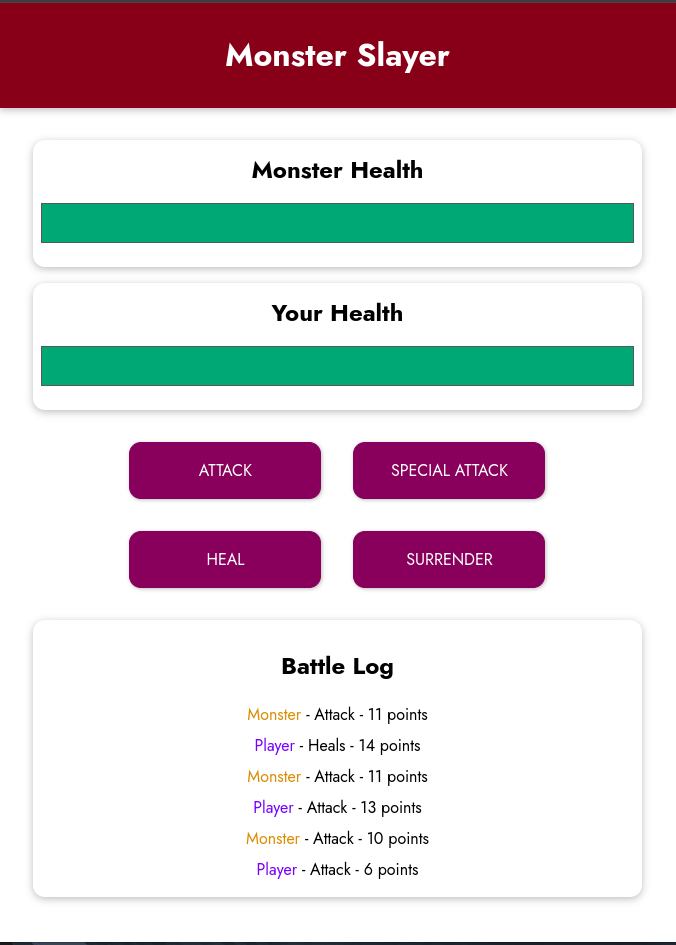
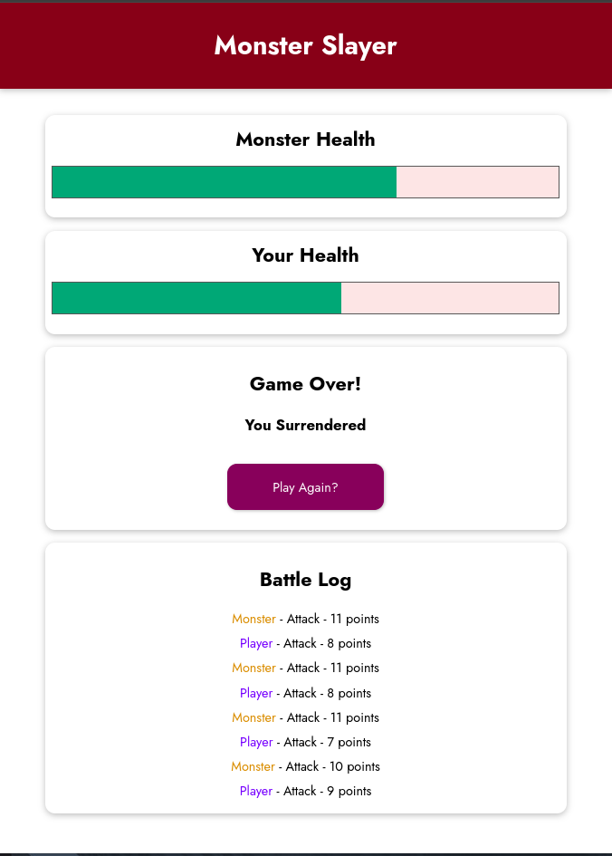

# Monster-Slayer-Game
A Simple Monster Slayer Game built using Vuejs

## Features
- Player gets four options: `Attack`, `Special Attack`, `Heal`, `Surrender`.
- `Attack` and `Special Attack` can be used to attack the monster.
- `Heal` can be used by the player to Heal themselves, but won't stop the monster from attacking.
- Use `Surrender` to end the game.
- Player can always start the game again once the Game is finished, or can re-start the game by clicking `Surrender`.

### Additional
A Player Log is provided as a reference for each step in the game.

## Screenshots

### Task Trackerrr App

